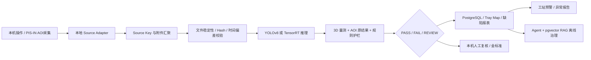

# PIS-IN AOI AI 智能质检项目总说明书 V3.5

## 1. 项目定位

项目周期为 2024.09-2025.01，8 人按阶段参与。当前采用 AOI 工控机单机独立运行模式，不接入自动化 Handler：操作员或本机 AOI 软件触发检测，PIS-IN 在本机完成 R/G/B/RING 图像采集，AI 服务完成数据关联、推理、复核与报表闭环。MES 可作为异步数据接收方，但不参与本地实时检测决策。

本版交付定位为“可运行 PoC + 数据适配层 + 生产门禁基线”。仓库当前没有真实 AOI 图片、标注集和 YOLO 权重，因此真实精度、现场 P95、持续吞吐和生产误报率必须通过现场数据审计与盲测确认。

## 2. 核心业务流程

## 3. 功能模块

1. **数据关联层**：`DeviceID + DeviceSessionID + InspectionSequence + TrayID + SlotIndex + Surface` 生成规范化 SHA-256 Source Key；R/G/B/RING 作为附件属性汇聚到同一 `event_uuid`。
2. **推理与决策层**：Demo/TensorRT 可替换适配器、3D 规则和 PASS/FAIL/REVIEW 三态决策；输入不完整或身份异常默认 REVIEW。
3. **质量运营层**：缺陷分类、滑动窗口工站预警、告警确认、DRAFT 异常报告、复核回写和模型治理。
4. **Agent/RAG 层**：数据质量 Agent、复核与异常报告 Agent、模型治理 Agent；PostgreSQL + pgvector 保存缺陷字典、SOP、设备手册、历史异常与发布说明。
5. **展示层**：总览、实时检测、Tray Map、人工复核、缺陷报表、预警与报告、模型治理、项目说明 8 个页面。

## 4. 架构类型

当前不是严格意义上的全微服务架构，而是部署在同一台工控机上的“模块化核心服务 + 独立辅助服务”架构：

- FastAPI API、领域模型、推理编排和数据访问属于模块化单体核心，保证单件检测路径简单、低延迟、易排障。
- Agent/RAG 作为独立进程和容器运行，发生超时或故障时只影响报告草稿，不影响本地检测与复核。
- React/Nginx、PostgreSQL、simulator 与 API 通过 Docker Compose 统一部署，服务可独立重启，但共享同一工控机资源。
- Handler TCP/握手/BIN 回传接口保留为未来扩展，默认通过 `HANDLER_INTEGRATION_ENABLED=false` 关闭，不属于当前交付主链路。

## 5. 技术栈与代码落点

| 层级 | 技术 | 代码落点 |
|---|---|---|
| 前端 | React 18、TypeScript、Vite、ECharts、Lucide | `apps/web/src` |
| API | FastAPI、Pydantic、SQLAlchemy 2、Alembic | `apps/api/app` |
| 推理 | YOLOv8 基线、ONNX/TensorRT 替换接口、Demo adapter | `apps/api/app/inference` |
| 数据库 | PostgreSQL 16、pgvector；本地测试 SQLite | `apps/api/app/models`、`services/agent-rag` |
| 治理 | 3 个 Agent、确定性 Provider、证据引用 RAG | `services/agent-rag/agent_rag` |
| 部署 | Docker Compose、Nginx、GPU overlay、健康检查 | `infra` |

## 6. 主要负责工作与个人成果口径

- 负责把误报、漏放、REVIEW、P95、吞吐和静默错配率拆解为可测试、可验收的产品与技术指标。
- 设计 Source Key、附件汇聚、状态机、隔离区和数据库幂等约束，解决多光源、3D、AOI 结果乱序、重复和身份缺失问题。
- 推动 FastAPI、YOLOv8/TensorRT 适配边界、三态决策、人工复核、缺陷报表、预警和 Agent/RAG 故障隔离落地。
- 完成可运行单机 PoC：当前 API 63 条、Agent/RAG 6 条、simulator 2 条测试通过；前端具备 8 个业务页面，Compose 可启动并通过健康检查。
- 明确事实边界：当前交付证明软件链路、部署和安全门禁可复现，不把缺少真实图片、权重、TensorRT Engine 和连续生产样本的指标写成生产实绩。

## 7. 质量目标口径

AOI NG 候选池综合误报率阶段目标：基线 12%，PoC <=6%，受控上线 <=3%，成熟阶段 <=1.5%。以全检件为分母的全检误报率单独管理，目标不高于 0.5%。所有阶段必须同步统计关键缺陷漏放率、REVIEW 比例、P95、吞吐和静默错配率。

## 8. 团队、算力与内部估算

- 团队：产品/AI 负责人 1、后端 2、前端 1、算法 2、测试 1、实施运维 1。
- 推荐 PoC 算力：训练 2 x L40S 48GB；边缘 2 台 RTX 4000 Ada 20GB；Agent/RAG 1 x L4 24GB；40-80TB NAS。
- 内部预算口径：500 万元，用于人员研发、GPU/存储、标注治理、集成测试和预备金；不进入前端和客户 PDF。

## 9. 单机上线门禁

设计评审、本机相机/文件接口确认、连续样本审计、乱序/重复/延迟/断电重启注入、独立盲测、持续吞吐、影子差异分析和回滚演练全部通过后，才允许在单机端扩大自动 PASS 范围。任何静默错配、身份不明、关键输入缺失或模型不可用都不得自动 PASS；Agent/RAG 不可用时本地检测继续，报告降级为人工补充。
