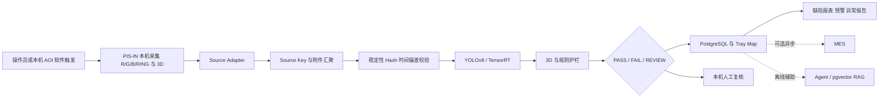

# PIS-IN AOI AI 智能质检技术方案设计书

**文档版本**：V3.5 单机实施版  
**决策日期**：2026-08-10  
**项目周期**：2024.09-2025.01  
**当前状态**：可运行 PoC、数据适配与部署基线  
**当前边界**：不接入自动化 Handler；Handler 能力默认关闭，仅作未来扩展

## 1. 项目定位

本项目面向 PIS-IN AOI 多光源 2D 图像、3D 量测和原 AOI 结果，建设可在一台 AOI 工控机上运行的 AI 辅助质检系统。操作员或本机 PIS-IN AOI 软件触发检测，系统在本机完成采集、数据关联、YOLOv8/TensorRT 推理、PASS/FAIL/REVIEW 决策、人工复核、缺陷报表和异常报告。

项目不改变 PIS-IN 原有机械与基础检测能力，不依赖 Handler 的 START/RESULT/BIN 实时握手。MES 可作为可选异步数据接收方，但不参与本机实时判定。

## 2. 项目目标

1. 将多光源、3D、原 AOI、Tray、Slot 和批次信息关联为一个可追溯检测事件。
2. 使用 YOLOv8 基线与 TensorRT 适配边界输出缺陷类别、置信度和定位证据。
3. 使用三态决策保护质量边界：高置信正常进入 PASS，明确缺陷进入 FAIL，不完整、未知或低置信输入进入 REVIEW。
4. 提供本机人工复核、Tray Map、缺陷分类报表、滑动窗口预警和异常报告闭环。
5. 将 Agent/RAG 作为独立辅助服务，用于证据检索、报告草稿和模型治理建议，不进入实时自动 PASS 路径。
6. 通过 Docker Compose 在单台工控机完成可重复部署、健康检查和故障隔离。

## 3. 当前业务流程



异常处理遵循 fail-closed：身份缺失、附件错配、关键输入缺失、模型不可用或处理超时均不得自动 PASS。

## 4. 架构类型

当前采用“单机容器化模块服务架构”，不是严格的全微服务架构。

| 层级 | 组成 | 设计理由 |
|---|---|---|
| 展示层 | React、TypeScript、Vite、ECharts、Nginx | 提供总览、实时检测、Tray Map、复核、报表和模型治理 |
| 核心应用 | FastAPI、Pydantic、领域服务、推理编排 | 单件检测主链路保持简单、确定、易排障 |
| 推理层 | YOLOv8s 基线、ONNX/TensorRT 适配器、3D 规则 | 模型与运行时可替换，异常时转 REVIEW |
| 数据层 | PostgreSQL 16、SQLAlchemy 2、Alembic、pgvector | 事务幂等、版本共存、审计和知识检索 |
| 辅助治理 | 3 个 Agent、RAG、确定性 Provider | 异步生成数据质量结论、报告草稿和发布建议 |
| 部署层 | Docker Compose、健康检查、restart policy、GPU overlay | 在一台工控机统一部署并隔离进程故障 |

FastAPI、领域模型、推理编排和数据访问构成模块化核心；Agent/RAG 独立运行，故障时不影响本机检测、复核和报表查询。

## 5. 核心模块

### 5.1 本机触发与数据适配

当前触发源为操作员或本机 PIS-IN AOI 软件。适配层负责读取设备导出或采集结果、验证文件稳定性、解析身份字段、计算 SHA-256，并组装内部标准对象。

确定性 Source Key 字段为：

```text
DeviceID + DeviceSessionID + InspectionSequence + TrayID + SlotIndex + Surface
```

R/G/B/RING 是附件属性，不参与事件主键。一个物理组件的多光源图像、3D 数据和原 AOI 结果必须汇聚到同一个 `event_uuid`。

### 5.2 数据一致性与状态机

事件状态包括 `RECEIVED`、`COLLECTING`、`READY`、`VALIDATED`、`INFERRED`、`REVIEW_REQUIRED`、`ARCHIVED`、`EXPIRED`、`QUARANTINED` 和 `INVALID`。

数据库是最终幂等依据：

- `source_key_hash` 保证一次物理检测唯一。
- 附件按 `event_uuid + data_type + light_id + file_hash` 去重。
- 推理结果按事件、模型版本、策略版本和输入指纹共存。
- 身份无法证明的数据进入 `quarantine_events`，不使用邻近时间戳或文件顺序猜测归属。

### 5.3 YOLOv8 与 TensorRT

PoC 以 YOLOv8s 作为速度、显存和精度的基线。已有可靠 ROI 时可优先使用 ROI 分类；需要多缺陷定位、框选证据或 ROI 不稳定时使用目标检测。

11 组光源不直接改成 11 通道输入。首期通过消融实验筛选 3-4 组高价值光源，优先构造标准三通道输入；只有真实盲测证明损失明显时，再评估四通道首层改造、结果级融合或特征级融合。

实施链路：

```text
PyTorch 权重 -> ONNX -> TensorRT FP16 Engine
图像预处理 -> YOLO 检测 -> 3D 后融合 -> 规则护栏 -> 三态决策
```

真实精度、P95、持续吞吐和 GPU 占用必须在目标工控机上实测。当前仓库没有真实 AOI 图片、标注集和生产权重，不将 Demo 延迟写成生产指标。

### 5.4 三态决策与人在回路

| 优先级 | 条件 | 结果 |
|---:|---|---|
| 1 | 身份缺失、错配、关键输入缺失、模型不可用 | REVIEW 或 QUARANTINED |
| 2 | 3D 硬规则超限或明确缺陷证据达到门槛 | FAIL |
| 3 | 输入完整、正常置信度达到经审批阈值 | PASS |
| 4 | 低置信度、未知类别、策略边界样本 | REVIEW |

人工复核是对 REVIEW 事件执行的具体动作；人在回路是系统治理原则，人保留金标准确认、异常报告批准、模型发布和高风险放行权。

### 5.5 缺陷报表与异常闭环

系统按产品、批次、工站、Tray、Slot、缺陷类别、模型版本和时间窗口统计 PASS/FAIL/REVIEW、缺陷率、误报过滤率和复核结果。

高缺陷率预警采用最小样本数、滑动窗口、连续异常次数和关键缺陷优先级，默认只通知与推动复核，不自动停机。告警确认后可生成 DRAFT 异常报告，报告事实来自事件、代表图片、3D 指标和知识库引用，根因结论由质量工程师确认。

### 5.6 Agent 与 RAG

| Agent | 作用 | 禁止事项 |
|---|---|---|
| 数据质量 Agent | 汇总身份、附件、时间偏差、重复和缺失风险 | 不修改事件身份，不创建自动 PASS |
| 复核与异常报告 Agent | 检索 SOP 和历史案例，生成带证据的 DRAFT | 不自动确认根因，不批准报告 |
| 模型治理 Agent | 汇总召回、漏放、P95、漂移和回滚证据 | 不直接发布模型 |

RAG 使用 PostgreSQL + pgvector，知识范围包括缺陷字典、SOP、设备手册、历史异常报告和模型发布说明。Agent/RAG 超时或不可用时，本机检测继续，报告标记为降级或由人工补充。

## 6. 数据模型

| 表 | 作用 | 关键字段 |
|---|---|---|
| `inspection_events` | 一次物理检测 | event_uuid、source_key_hash、Tray/Slot、状态、原 AOI、3D 摘要 |
| `data_attachment_links` | 多光源与 3D/AOI 附件 | light_id、data_type、file_path、file_hash、稳定时间 |
| `inference_results` | 多模型版本结果 | model_version、policy_version、decision、confidence、bbox、latency |
| `quarantine_events` | 身份缺失和冲突隔离 | quarantine_id、parse_error、extracted_fields、resolution |
| `review_records` | 人工复核金标准 | reviewer、decision、defect_code、comment |
| `station_alerts` | 工站异常窗口 | sample_count、defect_rate、threshold、status |
| `anomaly_reports` | 异常报告闭环 | evidence、draft、approval、resolution |

## 7. 部署模式

### 7.1 单机容器组成

```text
frontend (Nginx/React, 8080)
api (FastAPI, 内网 8000)
postgres (PostgreSQL/pgvector, 内网 5432)
agent-rag (内网 8013)
simulator (仅 Demo)
optional TensorRT GPU service
```

### 7.2 运行模式

| 模式 | 用途 | 自动 PASS |
|---|---|---|
| `demo` | 软件演示、培训、接口验证 | 禁止 |
| `shadow` | 真实本机采集与影子对比 | 最终结果保持 REVIEW |
| `controlled` | 质量门禁批准后的本机受控运行 | 仅 `AUTO_PASS_ENABLED=true` 时允许 |

`HANDLER_INTEGRATION_ENABLED` 默认值为 `false`。只有未来恢复 Handler 独立项目，并完成协议复审、硬件在环和错误分选测试后，才允许显式开启。

## 8. 测试与验收口径

当前软件验证覆盖 API/领域逻辑、Agent/RAG、模拟器、前端组件和端到端业务流程。生产验收必须增加：

1. PIS-IN 真实身份字段、光源集合和文件落盘行为确认。
2. 乱序、重复、延迟、断电重启、磁盘满和模型不可用故障注入。
3. 按 Tray、批次、设备和时间隔离的独立盲测。
4. 关键缺陷召回率、自动 PASS 漏放率、REVIEW 比例、P95 和持续吞吐。
5. 静默错配率为 0，任何不完整输入产生自动 PASS 的数量为 0。
6. 模型回滚、数据库恢复、日志审计和本机应急停用演练。

## 9. 质量目标

AOI NG 候选池综合误报率采用阶段目标：基线 12%，PoC 不高于 6%，受控上线不高于 3%，成熟阶段不高于 1.5%。以全检件为分母的误报率单独管理，目标不高于 0.5%。

上述均为目标值，不是当前生产实绩；必须同步报告关键缺陷漏放率、REVIEW 比例、置信区间、P95、持续吞吐和静默错配率。

## 10. 项目组织与个人职责

团队共 8 人，按阶段参与：产品/AI 负责人 1、后端 2、前端 1、算法 2、测试 1、实施运维 1。

本人主要负责：

- 将误报、漏放、REVIEW、P95、吞吐和错配率转化为阶段门禁。
- 设计 Source Key、附件汇聚、状态机、quarantine 和版本共存。
- 推动 YOLOv8/TensorRT 适配、3D 后融合和三态决策落地。
- 规划 3 个 Agent 与 RAG 的证据边界和故障隔离。
- 协调 API、前端、测试、部署文档和项目演示，形成可运行单机 PoC。

## 11. Handler 与 MES 边界

当前项目组决策是不接入自动化 Handler。已完成的 Handler TCP、SESSION_SYNC、BIN 和 Outbox 设计资产不删除，但默认关闭，不作为部署、联调或上线前置条件。

MES 仅作为可选异步数据接收方。MES 不可用不得影响本机采集、推理、复核和报表；待接口明确后通过独立 Outbox、幂等消息和补偿机制接入。

## 12. 上线结论

V3.5 可作为单机 PoC、数据适配层开发和现场验证基线。它不能直接等同于生产自动 PASS 批准。只有真实相机/文件接口、真实 YOLO/TensorRT、独立盲测、持续运行、故障注入、回滚演练和质量审批全部通过后，才可逐步扩大本机自动 PASS 范围。
